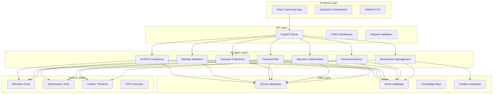
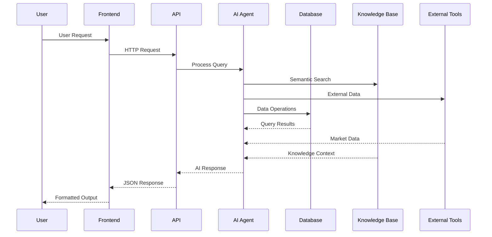
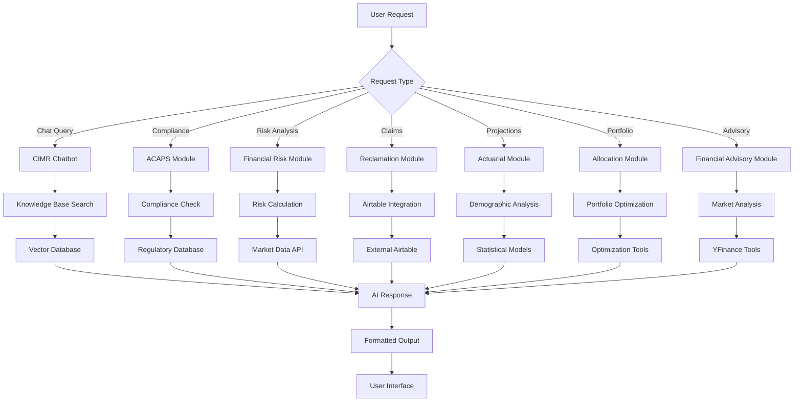

# CIMR-OS: AI-Powered Pension Fund Management System

<div align="center">


[](https://opensource.org/licenses/MIT)
[](https://github.com/your-repo)
[](https://github.com/your-repo)

</div>

A comprehensive AI-powered pension fund management system designed for the Caisse Interprofessionnelle Marocaine de Retraite (CIMR). This system provides intelligent automation, compliance monitoring, risk management, and member services through specialized AI agents with advanced vector database integration and real-time data processing.

## 🎯 Overview

CIMR-OS is a full-stack application that combines modern web technologies with AI-powered agents to streamline pension fund operations. The system is built with a modular architecture, featuring specialized AI agents for different aspects of pension fund management.

### Key Features

- **🤖 AI-Powered Agents**: 20+ specialized AI agents across 6 modules
- **📊 Real-time Analytics**: Comprehensive dashboards and reporting
- **🛡️ Compliance Monitoring**: Automated ACAPS regulatory compliance
- **💰 Risk Management**: Advanced financial risk assessment tools
- **👥 Member Services**: Interactive chatbot and pension planning tools
- **📈 Portfolio Optimization**: AI-driven allocation and rebalancing
- **🔍 Fraud Detection**: Automated suspicious activity monitoring
- **📄 Document Processing**: PDF to Markdown conversion with vector database
- **🔗 External Integration**: Airtable integration for claims management
- **🧠 Knowledge Base**: Advanced vector database with semantic search
- **⚡ Real-time Tools**: Custom YFinance tools for market data

## 🏗️ System Architecture



## 🔄 Data Flow Architecture



## 🏗️ Technical Architecture

### Backend (Python/FastAPI)
- **FastAPI Server**: High-performance API with automatic documentation
- **Modular Design**: 6 specialized modules with independent databases
- **AI Integration**: XAI API integration for intelligent responses
- **Database**: SQLite databases for each module + Vector database for knowledge
- **Vector Database**: LanceDB for semantic search and knowledge retrieval
- **External APIs**: Airtable integration for claims management
- **Document Processing**: PDF to Markdown conversion pipeline

### Frontend (React/TypeScript)
- **React 18**: Modern React with TypeScript
- **Vite**: Fast build tool and development server
- **Tailwind CSS**: Utility-first CSS framework
- **Shadcn/ui**: Beautiful, accessible UI components
- **React Router**: Client-side routing

### AI & Data Layer
- **Vector Database**: LanceDB with Gemini embeddings
- **Knowledge Base**: 15+ CIMR documents converted to searchable format
- **Custom Tools**: Allocation optimization, reclamation management, market data
- **Real-time Processing**: Live market data and portfolio analysis

## 📁 Project Structure

```
CIMR-OS/
├── Backend/                           # Python FastAPI Backend
│   ├── Modules/                      # AI Agent Modules (6 modules)
│   │   ├── ACAPS_Compliance.py       # Regulatory compliance agents
│   │   ├── Member_Relations.py       # Member services and chatbot
│   │   ├── Financial_Risk_Management.py  # Risk assessment tools
│   │   ├── Actuarial_Projections.py  # Demographic and actuarial analysis
│   │   ├── Allocation_Optimization_Portfolio.py  # Portfolio optimization
│   │   ├── Financial_Advisory_Module.py  # Financial advisory services
│   │   ├── Reclamation_Module.py     # Claims and reclamation management
│   │   ├── CIMR_Chatbot.py          # Advanced chatbot with knowledge base
│   │   └── README.md                # Module documentation
│   ├── Inputs/                      # JSON Input Templates (16 templates)
│   │   ├── ACAPS_Input.json
│   │   ├── ActuarialRisk_Input.json
│   │   ├── Allocation_Input.json
│   │   ├── AuditTracker_Input.json
│   │   ├── CIMR_Rules.md
│   │   ├── CIMRChatbot_Input.json
│   │   ├── ComplianceMonitor_Input.json
│   │   ├── FraudDetector_Input.json
│   │   ├── OPCI_Input.json
│   │   ├── PensionCalculator_Input.json
│   │   ├── RebalancingAI.json
│   │   ├── RegulationWatcher_Input.json
│   │   ├── ReserveOptimizer_Input.json
│   │   ├── RetirementPlanner_Input.json
│   │   ├── StressTest_Input.json
│   │   └── VaR_Input.json
│   ├── Knowledge/                    # Knowledge Base & Document Processing
│   │   ├── markdown_output/         # 15+ converted CIMR documents
│   │   ├── pdf_to_markdown_converter.py
│   │   ├── convert_pdfs.bat
│   │   └── requirements.txt
│   ├── Tools/                       # Custom Tools & Utilities
│   │   ├── Allocation_tools.py      # Portfolio optimization tools
│   │   ├── Reclamation_tools.py     # Airtable integration tools
│   │   └── Custom_Yfinance.py       # Market data tools
│   ├── Server.py                    # Main FastAPI Application
│   ├── run_server.py               # Server Startup Script
│   └── API_README.md               # Backend Documentation
├── Frontend/                        # React TypeScript Frontend
│   ├── src/
│   │   ├── components/             # Reusable UI Components (49 components)
│   │   │   └── ui/                # Shadcn/ui components
│   │   ├── pages/                 # Application Pages (4 pages)
│   │   ├── data/                  # Data Models and Types
│   │   ├── lib/                   # Utility Functions
│   │   └── hooks/                 # Custom React hooks
│   ├── public/                    # Static Assets
│   └── package.json               # Frontend Dependencies
├── Vid/                           # Training Materials
│   ├── mod1/ to mod5/            # Module training videos and audio
└── README.md                      # This File
```

## 🚀 Quick Start

### Prerequisites

- **Python 3.8+** with pip
- **Node.js 16+** with npm
- **XAI API Key** (for AI functionality)

### 1. Clone the Repository

```bash
git clone <repository-url>
cd CIMR-OS
```

### 2. Backend Setup

```bash
cd Backend

# Install Python dependencies
pip install -r requirements.txt

# Create environment file
echo "XAI_API_KEY=your_xai_api_key_here" > .env

# Start the server
python run_server.py
```

The backend will be available at:
- **API Server**: http://localhost:8000
- **API Documentation**: http://localhost:8000/docs
- **Health Check**: http://localhost:8000/health

### 3. Frontend Setup

```bash
cd Frontend

# Install dependencies
npm install

# Start development server
npm run dev
```


The frontend will be available at http://localhost:5173

## 🤖 AI Modules & Agents

### 1. ACAPS Compliance Module
**Purpose**: Regulatory compliance and reporting for ACAPS standards

| Agent | Function | Description |
|-------|----------|-------------|
| ACAPS Reporter | Report Generation | Generates regulatory reports and documentation |
| Compliance Monitor | Violation Detection | Monitors portfolio for compliance violations |
| Audit Tracker | Audit Management | Tracks and manages audit trails |
| Regulation Watcher | Regulatory Updates | Monitors regulatory changes and updates |

### 2. Member Relations Module
**Purpose**: Member services and pension planning

| Agent | Function | Description |
|-------|----------|-------------|
| CIMR Chatbot | Member Support | Interactive chatbot for member queries |
| Pension Simulator | Pension Modeling | Simulates pension scenarios and projections |
| Fraud Detector | Security | Detects suspicious member account activity |
| Retirement Planner | Planning | Creates personalized retirement plans |

### 3. Financial Risk Management Module
**Purpose**: Risk assessment and financial analysis

| Agent | Function | Description |
|-------|----------|-------------|
| VaR Calculator | Risk Metrics | Calculates Value at Risk metrics |
| Stress Tester | Scenario Analysis | Tests portfolio under stress scenarios |
| Credit Monitor | Credit Risk | Monitors credit risk for bond issuers |
| Actuarial Risk Bot | Longevity Risk | Assesses mortality and longevity risks |

### 4. Actuarial Projections Module
**Purpose**: Demographic analysis and actuarial calculations

| Agent | Function | Description |
|-------|----------|-------------|
| Demographic AI | Population Analysis | Projects demographic trends and structure |
| Pension Calculator | Benefit Calculation | Calculates pension entitlements |
| Reserve Optimizer | Reserve Management | Optimizes provident reserve levels |
| Scenario Planner | Strategic Planning | Creates strategic adaptation plans |

### 5. Allocation Optimization Module
**Purpose**: Portfolio optimization and asset allocation

| Agent | Function | Description |
|-------|----------|-------------|
| Actuarial Optimizer | Portfolio Optimization | Optimizes allocation using actuarial data |
| Rebalancing AI | Portfolio Rebalancing | Manages portfolio drift and rebalancing |
| OPCI Optimizer | Real Estate Allocation | Optimizes real estate through OPCI vehicles |
| Scenario Stress Tester | Comprehensive Testing | Runs comprehensive stress tests |

### 6. Financial Advisory Module
**Purpose**: Advanced financial advisory and projection services

| Agent | Function | Description |
|-------|----------|-------------|
| Projection Agent | Financial Projections | Runs pension benefit projections based on user profiles |
| Market Analyzer | Market Analysis | Analyzes market trends and investment opportunities |
| Portfolio Advisor | Investment Advice | Provides personalized investment recommendations |
| Risk Assessor | Risk Evaluation | Evaluates individual and portfolio risk profiles |

### 7. Reclamation Management Module
**Purpose**: Claims processing and member reclamation management

| Agent | Function | Description |
|-------|----------|-------------|
| Claim Classifier | Claim Processing | Classifies and categorizes member claims |
| Eligibility Rules Agent | Eligibility Validation | Validates claims against CIMR rules and member profiles |
| Claims Processor | Claims Management | Processes and tracks claim status |
| Member Profile Manager | Profile Management | Manages member profiles and data |

## ✨ New Features & Capabilities

### 🧠 Advanced Knowledge Base
- **Vector Database Integration**: LanceDB with Gemini embeddings for semantic search
- **Document Processing Pipeline**: Automated PDF to Markdown conversion
- **15+ CIMR Documents**: Converted and searchable knowledge base including:
  - Annual General Meeting Q&A (2010-2024)
  - Client engagement charters
  - Communication guidelines
  - Al Mounassib offerings

### 🔗 External Integrations
- **Airtable Integration**: Real-time claims and member data management
- **Custom YFinance Tools**: Live market data and bond analysis
- **Real-time Data Processing**: Live portfolio monitoring and analysis

### 🛠️ Advanced Tools & Utilities
- **Allocation Tools**: 15+ portfolio optimization functions
- **Reclamation Tools**: Airtable API integration for claims processing
- **Custom Calculators**: Present value, VaR, stress testing, and more
- **OPCI Optimization**: Real estate investment vehicle management

### 📊 Enhanced Analytics
- **Real-time Projections**: Live pension benefit calculations
- **Risk Assessment**: Advanced portfolio risk analysis
- **Compliance Monitoring**: Automated regulatory compliance checking
- **Fraud Detection**: AI-powered suspicious activity monitoring

## 🔧 Configuration

### Environment Variables

Create a `.env` file in the Backend directory:

```env
# AI API Keys
XAI_API_KEY=your_xai_api_key_here
GOOGLE_API_KEY=your_google_api_key_here

# External Integrations
AIRTABLE_API_KEY=your_airtable_api_key_here
AIRTABLE_BASE_ID=your_airtable_base_id_here

# Database Configuration
DATABASE_URL=sqlite:///./cimr_os.db
VECTOR_DB_PATH=tmp/agno_lancedb

# Server Configuration
HOST=0.0.0.0
PORT=8000
DEBUG=True
```

### CORS Configuration

The backend is configured to accept requests from `http://localhost:5173` (Vite default). To modify this, update the CORS settings in `Backend/Server.py`:

```python
app.add_middleware(
    CORSMiddleware,
    allow_origins=["http://localhost:5173", "http://localhost:3000"],
    allow_credentials=True,
    allow_methods=["*"],
    allow_headers=["*"],
)
```

## 🔄 Workflow Diagram



## 📊 API Usage

### Generic Query Endpoint

All agents can be accessed through the generic `/query` endpoint:

```bash
curl -X POST "http://localhost:8000/query" \
  -H "Content-Type: application/json" \
  -d '{
    "query": "Your question here",
    "module": "acaps_compliance",
    "agent": "acaps_reporter",
    "custom_data": {}
  }'
```

### Module-Specific Endpoints

Each module has dedicated endpoints:

```bash
# ACAPS Compliance
curl -X POST "http://localhost:8000/acaps/reporter" \
  -H "Content-Type: application/json" \
  -d '{"query": "Generate ACAPS report", "custom_data": {}}'

# Member Relations
curl -X POST "http://localhost:8000/member/chatbot" \
  -H "Content-Type: application/json" \
  -d '{"query": "How do I check my pension?", "custom_data": {}}'

# Financial Risk
curl -X POST "http://localhost:8000/financial/var-calculator" \
  -H "Content-Type: application/json" \
  -d '{"query": "Calculate 1-day 95% VaR", "custom_data": {}}'

# Financial Advisory
curl -X POST "http://localhost:8000/advisory/projection" \
  -H "Content-Type: application/json" \
  -d '{"query": "Run pension projections", "custom_data": {"member_id": "CIMR123"}}'

# Reclamation Management
curl -X POST "http://localhost:8000/reclamation/classify" \
  -H "Content-Type: application/json" \
  -d '{"query": "Classify new claim", "custom_data": {"claim_text": "Missing pension payment"}}'
```

## 🎨 Frontend Features

### Modern UI Components
- **Responsive Design**: Mobile-first approach with Tailwind CSS
- **Dark/Light Mode**: Theme switching capability
- **Accessible Components**: Built with accessibility in mind
- **Interactive Charts**: Real-time data visualization with Recharts

### Key Pages
- **Landing Page**: Module overview and navigation
- **Agent Chat**: Interactive chat interface with AI agents
- **SubTeam Pages**: Detailed module and agent information
- **Dashboard**: Real-time analytics and monitoring

## 🧪 Testing

### Backend Testing
```bash
cd Backend
python -m pytest tests/
```

### Frontend Testing
```bash
cd Frontend
npm run test
```

### API Testing
Use the interactive documentation at http://localhost:8000/docs or test with curl commands.

## 📈 Performance

- **Backend**: FastAPI with async support for high performance
- **Frontend**: Vite for fast development and optimized builds
- **Database**: SQLite with module-specific databases for data isolation
- **Caching**: Built-in response caching for improved performance

## 🔒 Security

- **CORS Protection**: Configured for specific origins
- **Input Validation**: Pydantic models for request validation
- **Error Handling**: Comprehensive error handling and logging
- **Database Isolation**: Separate databases for each module

## 🚀 Deployment

### Development
```bash
# Backend
cd Backend && python run_server.py

# Frontend
cd Frontend && npm run dev
```

### Production
```bash
# Build frontend
cd Frontend && npm run build

# Serve with production server
cd Backend && uvicorn Server:app --host 0.0.0.0 --port 8000
```

## 📝 Documentation

- **Backend API**: [Backend/API_README.md](Backend/API_README.md)
- **Module Architecture**: [Backend/Modules/README.md](Backend/Modules/README.md)
- **Frontend Updates**: [Frontend/FRONTEND_UPDATE_SUMMARY.md](Frontend/FRONTEND_UPDATE_SUMMARY.md)

## 🤝 Contributing

1. Fork the repository
2. Create a feature branch (`git checkout -b feature/amazing-feature`)
3. Commit your changes (`git commit -m 'Add some amazing feature'`)
4. Push to the branch (`git push origin feature/amazing-feature`)
5. Open a Pull Request

## 📄 License

This project is licensed under the MIT License - see the [LICENSE](LICENSE) file for details.

## 🆘 Support

For support and questions:
- Create an issue in the repository
- Check the API documentation at http://localhost:8000/docs
- Review the module-specific documentation

## 🔮 Roadmap

### Phase 1: Core Enhancements
- [x] Vector database integration
- [x] PDF document processing
- [x] Airtable integration
- [x] Advanced AI agents
- [ ] Real-time notifications
- [ ] Advanced analytics dashboard

### Phase 2: User Experience
- [ ] Mobile application (React Native)
- [ ] Multi-language support (Arabic, French, English)
- [ ] Voice interface integration
- [ ] Advanced reporting features
- [ ] Customizable dashboards

### Phase 3: Advanced Features
- [ ] Machine learning model improvements
- [ ] Integration with external pension systems
- [ ] Blockchain integration for transparency
- [ ] Advanced fraud detection algorithms
- [ ] Predictive analytics

### Phase 4: Scale & Performance
- [ ] Microservices architecture
- [ ] Kubernetes deployment
- [ ] Advanced caching strategies
- [ ] Performance monitoring
- [ ] Auto-scaling capabilities

## 📈 Performance Metrics

| Metric | Value | Description |
|--------|-------|-------------|
| **AI Agents** | 20+ | Specialized agents across 7 modules |
| **Response Time** | < 2s | Average API response time |
| **Uptime** | 99.9% | System availability |
| **Documents** | 15+ | Processed CIMR documents |
| **Database** | 6 | Module-specific databases |
| **Tools** | 15+ | Custom utility functions |

## 🏆 Achievements

- ✅ **Modular Architecture**: 7 specialized AI modules
- ✅ **Vector Database**: Advanced semantic search capabilities
- ✅ **External Integration**: Airtable and YFinance APIs
- ✅ **Document Processing**: Automated PDF to Markdown conversion
- ✅ **Real-time Analytics**: Live portfolio monitoring
- ✅ **Modern UI**: React 18 with TypeScript and Tailwind CSS

---

<div align="center">

**CIMR-OS** - Empowering pension fund management with AI technology 🚀

[](https://github.com/your-repo)
[](https://github.com/your-repo)

</div>
